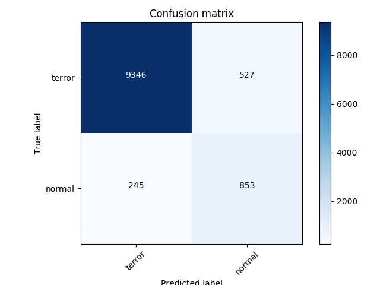

## terror

暴恐评测工具

### 暴恐检测

1、使用方法：

```
▶ python bk-det-eval.py -h
usage: bk-det-eval.py [-h] --groundtruth GROUNDTRUTH --result RESULT

script for bk detection test

optional arguments:
  -h, --help            show this help message and exit
  --groundtruth GROUNDTRUTH, -g GROUNDTRUTH
                        groundtruth from labelX. XXX.json
  --result RESULT, -r RESULT
                        test result from refinedet or rfcn. XXX.tsv
```

- -g：labelx导出的groundtruth文件
- -r：暴恐检测API返回结果文件

2、文件格式

每行为一张图片对应的数据

groundtruth 行数据格式:

```
{
    "url": "http://oquqvdmso.bkt.clouddn.com/atflow-log-proxy/images/terror-detect-2018-04-01T20-46-26-kXFB5XrNwg1c-8bvHUobhw==", 
    "type": "image", 
    "label": [
        {
            "name": "terror", 
            "type": "classification", 
            "version": "1", 
            "data": [
                {
                    "class": "terror", 
                    "ground_truth": true
                }
            ]
        }
    ]
}
```

result 行数据格式：

```
terror-detect-2018-04-01T20-46-26-kXFB5XrNwg1c-8bvHUobhw==  [{"index": 5, "score": 0.8849181532859802, "pts": [[19, 20], [53, 20], [53, 42], [19, 42]], "class": "guns"}]
```

3、代码运行

```
▶ python bk_det_test.py -g bk-det-gt.json -r terror-refinedet.csv
confusion matrix:
[[9346  527]
 [ 245  853]]
accuracy:         0.929632667943
terror_recall:      0.946622100679
terror_precision:   0.974455218434
normal_recall:    0.776867030965
normal_precision: 0.618115942029
Confusion matrix
[[9346  527]
 [ 245  853]]
```

结果解释：

- accuracy：准确率
- terror_recall：暴恐图片召回率
- terror_precision：暴恐图片精确率
- normal_recall：正常图片召回率
- normal_precision：正常图片精确率
- Confusion matrix：混淆矩阵（如下图所示）

